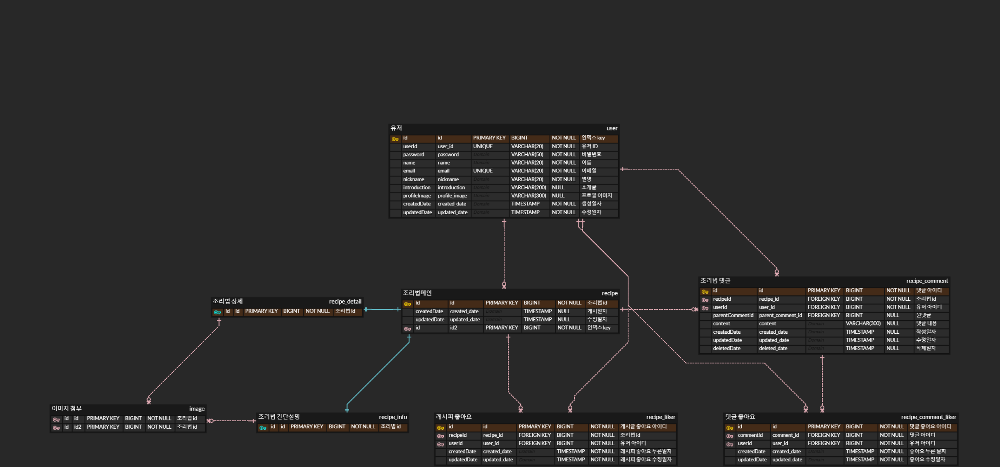

# 레시피 공유 프로젝트
> 레시피 공유 프로젝트

## 목차
 * [개요](#개요)
 * [구현 우선순위](#구현우선순위)
 * [사용한 기술](#사용한-기술)
 * [구현 기능](#구현-기능)
 * [ERD](#ERD)
 * [스크린샷](#스크린샷)
 * [개발 기록(10/16~)](#프로젝트-현황)
 * [개선 사항](#개선-사항추후-프로젝트-완성-이후에-작성)

## 개요
 * 프로젝트 이름 : recipe
 * 개발 인원 : 1명
 * 주요 기능
   * 회원관리
     * 회원가입
     * 로그인
     * 회원 탈퇴
   * 레시피 
     * 요리명, 완성사진, 소요시간, 카테고리, 난이도, 재료목록
     * 추가/수정/삭제
   * 레시피 상세
     * 순차적으로 요리방법에 대해 설명(사진 첨부 가능)
     * 
   * 댓글
     * 추가/수정/삭제
   * 피드
     * 팔로잉/팔로우
     
## 구현우선순위
* 1순위 : 회원관리기능(회원가입, 로그인)관련 기능, 
* 2순위 : 레시피(메인) 등록 및 조회
* 3순위 : 팔로우/팔로잉 구현
* 4순위 : 레시피 상세 작성/수정/삭제/읽기
## 사용한 기술

## 구현 기능
* 회원관리
     * 회원가입
       * 가입시 이메일 인증 메일 발송
     * 로그인
       * 패스워드 데이터베이스에 저장 할 때 원문 그대로 저장하는것은 보안상 취약하므로  해싱 하여 저장
       * 해싱으로는 SHA-256 사용 예정
     * 회원 탈퇴
* 레시피
  * 공통
    * 로컬형식으로 우선 구현 후 -> 이미지 저장을 위해 AWS-S3를 구현을 목표로 함
    * 등록 삭제 수정
    * 검색기능 구현
  * 메인
    * 요리명, 완성사진, 소요시간, 카테고리, 난이도, 재료목록
  * 상세
    * 객체(순서,사진,부가설명)형태의 리스트 형식
    * 최초 등록시 단계를 추가/삭제하면서 조리법을 등록 할수 있어야된다.
* 댓글/ 좋아요
  * 메인 게시글 영역 아래에 작성일 기준으로 보여준다.
  * 댓글 양에 따라 페이징 처리
  * 댓글 작성자는 자신의 댓글 삭제 가능
  * 댓글 작성자 클릭시 해당 유저 페이지로 이동
  * 추가/수정/삭제
  * 게시글/ 댓글에 좋아요 버튼 누를시 개수 갱신(취소시에도 갱신)
  * 댓글과 좋아요에 대한 알림을 이메일로 수신(제일 후 순위로 개발 예정)
* 팔로워/팔로우
    * 공통
      * 팔로우/팔로워 신청시 그 숫자 반영
      * 자신/임의이 유저 페이지에서 팔로워/팔로우 목록을 확인할수 있다.
      * 목록에서 유저 아이디 클릭시 해당 유저의 페이지로 이동
      * 팔로우시 상대방 이메일로 알림이 가도록 설정(후순위)
    * 팔로워
      * 나를 팔로우 하는 사람 목록 확인
      * 나를 팔로우 하는 사람중 내가 팔로우 하지 않은사람에 대해서 맞팔로우 여부를 묻는 버튼 활성화
    * 팔로우
      * 내가 팔로우 하는 사람 목록 확인
      * 다른 유저의 페이지 방문후 팔로우 신청 가능
* 검색
  * 요리 검색
  * 유저 검색
## ERD

## 스크린샷

## 사용법

## 프로젝트 현황

## 개선 사항(추후 프로젝트 완성 이후에 작성)
